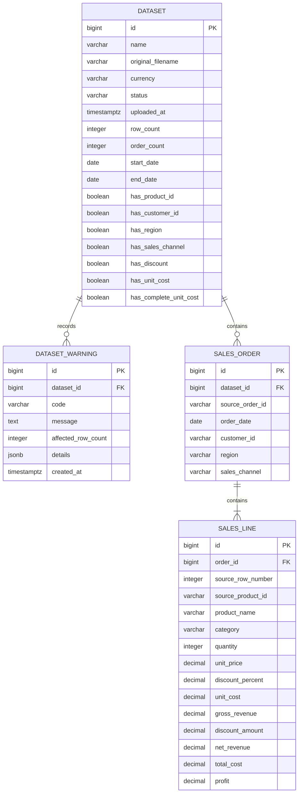

# Vendilume Database Design

## 1. Purpose

This document defines the initial PostgreSQL database design for Vendilume. It describes the persistent entities, fields, relationships, constraints, indexes, deletion behavior, Django mapping, and read-only analytics view used by Grafana.

The design supports the MVP workflow defined in [`SYSTEM_DESIGN.md`](SYSTEM_DESIGN.md) and the sales-data contract defined in [`DATA_SPECIFICATION.md`](DATA_SPECIFICATION.md).

---

## 2. Design Principles

The database design follows these principles:

- PostgreSQL is the persistent source of truth after a successful import.
- Every imported dataset remains logically independent.
- User-supplied identifiers are stored as source values, not used as database primary keys.
- A failed import must leave no partial sales dataset.
- Imported sales facts are treated as immutable in the MVP.
- Important numeric and relational rules are enforced by database constraints.
- Grafana receives read-only access through a flattened analytics view.
- The schema remains small enough to understand, test, and implement reliably.

---

## 3. Schema Overview

The initial schema contains four persistent entities:

| Entity | Responsibility |
| --- | --- |
| `Dataset` | Stores upload metadata, currency, summary values, and available-data flags |
| `DatasetWarning` | Stores non-blocking warnings retained after a successful import |
| `SalesOrder` | Stores one completed order within a dataset |
| `SalesLine` | Stores one product line and its calculated financial values |

The corresponding logical table names are:

```text
vendilume_dataset
vendilume_dataset_warning
vendilume_sales_order
vendilume_sales_line
```

The Grafana-facing view is:

```text
analytics_sales
```

---

## 4. Entity Relationship Diagram



Cardinality summary:

- One dataset may temporarily contain no orders while it is not ready; every `READY` dataset contains one or more sales orders.
- One sales order contains one or more sales lines.
- One dataset may contain zero or more retained warnings.
- A sales order and its lines belong to exactly one dataset.

---

## 5. Dataset Entity

`Dataset` represents one uploaded dataset and its application-level metadata. In the synchronous MVP, a normal successful import becomes visible only after the complete record set is committed with `READY` status.

### 5.1 Fields

| Field | PostgreSQL type | Null | Default | Description |
| --- | --- | ---: | --- | --- |
| `id` | `bigint` | No | Generated | Internal primary key |
| `name` | `varchar(255)` | No | — | User-provided name or name derived from the filename |
| `original_filename` | `varchar(255)` | No | — | Original uploaded filename, without storing the original file |
| `currency` | `varchar(3)` | No | — | Uppercase three-letter dataset currency code |
| `status` | `varchar(20)` | No | `READY` | Operational dataset status |
| `uploaded_at` | `timestamptz` | No | Current time | Time at which the import was committed |
| `row_count` | `integer` | No | `0` | Number of imported sales lines |
| `order_count` | `integer` | No | `0` | Number of distinct imported orders |
| `start_date` | `date` | Yes | `NULL` | Earliest order date |
| `end_date` | `date` | Yes | `NULL` | Latest order date |
| `has_product_id` | `boolean` | No | `false` | Whether the optional `product_id` column was included |
| `has_customer_id` | `boolean` | No | `false` | Whether the optional `customer_id` column was included |
| `has_region` | `boolean` | No | `false` | Whether the optional `region` column was included |
| `has_sales_channel` | `boolean` | No | `false` | Whether the optional `sales_channel` column was included |
| `has_discount` | `boolean` | No | `false` | Whether the optional `discount_percent` column was included |
| `has_unit_cost` | `boolean` | No | `false` | Whether the optional `unit_cost` column was included |
| `has_complete_unit_cost` | `boolean` | No | `false` | Whether every imported line contains valid unit-cost data |

### 5.2 Status Values

Supported status values are:

| Status | Meaning |
| --- | --- |
| `PROCESSING` | Import work has started but is not available for analytics |
| `READY` | The complete dataset was committed successfully |
| `FAILED` | Processing failed and the dataset is unavailable |

The synchronous MVP normally creates the dataset and its sales records within one transaction and exposes only the resulting `READY` dataset. The additional values support safe recovery and a possible future background-processing workflow.

Only `READY` datasets may appear in Grafana analytics.

### 5.3 Dataset Constraints

The database must enforce:

- `name` cannot be empty after trimming.
- `original_filename` cannot be empty after trimming.
- `currency` must contain exactly three uppercase letters.
- `status` must be one of `PROCESSING`, `READY`, or `FAILED`.
- `row_count` and `order_count` must never be negative.
- `row_count` and `order_count` must be greater than zero for a `READY` dataset.
- `start_date` and `end_date` must both be present for a `READY` dataset.
- When both dates are present, `start_date` must be earlier than or equal to `end_date`.
- `has_complete_unit_cost` cannot be true when `has_unit_cost` is false.

Dataset names are not unique. A user may intentionally import different datasets with the same display name.

### 5.4 Cached Summary Values

`row_count`, `order_count`, `start_date`, and `end_date` could be calculated from related records, but they are stored on `Dataset` to make dataset-history pages inexpensive and straightforward.

Django calculates these values from the validated data and stores them in the same transaction as the orders and sales lines. Imported data is immutable in the MVP, so these cached values do not require ongoing synchronization.

---

## 6. DatasetWarning Entity

`DatasetWarning` stores non-blocking issues that should remain visible after a successful import.

Validation errors are not stored here because an invalid dataset is rejected and not imported.

### 6.1 Fields

| Field | PostgreSQL type | Null | Default | Description |
| --- | --- | ---: | --- | --- |
| `id` | `bigint` | No | Generated | Internal primary key |
| `dataset_id` | `bigint` | No | — | Foreign key to `Dataset` |
| `code` | `varchar(50)` | No | — | Stable machine-readable warning code |
| `message` | `text` | No | — | Human-readable explanation |
| `affected_row_count` | `integer` | Yes | `NULL` | Number of affected rows when applicable |
| `details` | `jsonb` | Yes | `NULL` | Small structured details such as ignored column names |
| `created_at` | `timestamptz` | No | Current time | Time at which the warning was recorded |

### 6.2 Initial Warning Codes

| Code | Meaning |
| --- | --- |
| `UNSUPPORTED_COLUMNS` | Extra CSV columns were ignored |
| `DUPLICATE_ROWS` | Exact duplicate rows were detected and retained |
| `INCOMPLETE_OPTIONAL_DATA` | An optional column contains missing values that limit analytics |

### 6.3 Warning Constraints

- `code` cannot be empty.
- `message` cannot be empty.
- `affected_row_count`, when present, must be greater than zero.
- `details`, when present, must contain a JSON object rather than an unrestricted scalar value.

Warnings are deleted automatically when their parent dataset is deleted.

---

## 7. SalesOrder Entity

`SalesOrder` represents one completed source order within one imported dataset.

The model is named `SalesOrder` instead of `Order` to avoid ambiguity and conflicts with SQL ordering terminology.

### 7.1 Fields

| Field | PostgreSQL type | Null | Description |
| --- | --- | ---: | --- |
| `id` | `bigint` | No | Internal primary key |
| `dataset_id` | `bigint` | No | Foreign key to `Dataset` |
| `source_order_id` | `varchar(255)` | No | Original CSV `order_id` value |
| `order_date` | `date` | No | Completed-order date |
| `customer_id` | `varchar(255)` | Yes | Optional source customer identifier |
| `region` | `varchar(255)` | Yes | Optional geographic value |
| `sales_channel` | `varchar(100)` | Yes | Optional sales-channel value |

### 7.2 Order Constraints

The database must enforce:

- `source_order_id` cannot be empty after trimming.
- The pair `(dataset_id, source_order_id)` must be unique.
- Optional text fields use `NULL`, not empty strings, when no value is available.

The application validates that `order_date` is not in the future at upload time. This rule is time-dependent and is therefore enforced by the application rather than a permanent database check constraint.

### 7.3 Consolidating CSV Rows

Several CSV rows may share one `order_id`. Pandas validates that their order-level values are consistent and produces one `SalesOrder` record.

For optional order-level fields:

- If every row is blank, the stored value is `NULL`.
- If one consistent non-empty value exists, that value is stored.
- Conflicting non-empty values cause validation failure before persistence.

---

## 8. SalesLine Entity

`SalesLine` represents one imported CSV data row and stores its product attributes, quantities, source values, and calculated financial values.

### 8.1 Identity and Product Fields

| Field | PostgreSQL type | Null | Description |
| --- | --- | ---: | --- |
| `id` | `bigint` | No | Internal primary key |
| `order_id` | `bigint` | No | Foreign key to `SalesOrder` |
| `source_row_number` | `integer` | No | Physical CSV row number, including the header as row 1 |
| `source_product_id` | `varchar(255)` | Yes | Optional original CSV `product_id` value |
| `product_name` | `varchar(255)` | No | Cleaned display name of the product |
| `category` | `varchar(255)` | No | Cleaned display category |

### 8.2 Quantity and Financial Fields

| Field | PostgreSQL type | Null | Description |
| --- | --- | ---: | --- |
| `quantity` | `integer` | No | Positive whole number of units sold |
| `unit_price` | `numeric(14,2)` | No | Price of one unit before discount |
| `discount_percent` | `numeric(5,2)` | No | Discount percentage, defaulting to `0.00` |
| `unit_cost` | `numeric(14,2)` | Yes | Optional cost of one unit |
| `gross_revenue` | `numeric(18,2)` | No | `quantity × unit_price` |
| `discount_amount` | `numeric(18,2)` | No | Discount applied to gross revenue |
| `net_revenue` | `numeric(18,2)` | No | Gross revenue minus discount amount |
| `total_cost` | `numeric(18,2)` | Yes | `quantity × unit_cost` |
| `profit` | `numeric(18,2)` | Yes | Net revenue minus total cost |

### 8.3 Sales-Line Constraints

The database must enforce:

- `source_row_number` must be greater than one because row 1 is the CSV header.
- The pair `(order_id, source_row_number)` must be unique.
- `product_name` and `category` cannot be empty after trimming.
- `quantity` must be greater than zero.
- `unit_price` must be greater than or equal to zero.
- `discount_percent` must be between zero and one hundred, inclusive.
- `unit_cost`, when present, must be greater than or equal to zero.
- `gross_revenue`, `discount_amount`, and `net_revenue` must be greater than or equal to zero.
- `total_cost`, when present, must be greater than or equal to zero.
- If `unit_cost` is `NULL`, `total_cost` and `profit` must also be `NULL`.
- If `unit_cost` is not `NULL`, `total_cost` and `profit` must not be `NULL`.

Profit may be negative and must not have a non-negative check constraint.

### 8.4 Decimal Calculations

All financial calculations use decimal arithmetic rather than binary floating-point arithmetic.

Pandas processing should use decimal-safe values, and Django should map financial fields to `DecimalField`. Calculated currency values are rounded to two decimal places using one documented rounding rule before insertion.

For the MVP, Vendilume uses standard half-up rounding:

```text
ROUND_HALF_UP
```

The same stored calculated values are used by Django and Grafana so both layers display consistent totals.

---

## 9. Why Product and Customer Are Not Separate Entities

The MVP does not maintain a product catalog or customer-management system. Uploaded datasets are independent analytical snapshots, and their optional identifiers may use unrelated formats.

Creating global `Product`, `Category`, `Customer`, `Region`, or `SalesChannel` tables would require Vendilume to decide whether similar values from different datasets represent the same real-world entity. The available data does not support that decision reliably.

Therefore:

- Product name, category, and optional product ID are stored on `SalesLine`.
- Customer ID, region, and sales channel are stored on `SalesOrder`.
- Repeated descriptive values are accepted as deliberate analytics-oriented denormalization.
- Cleaning and case normalization prevent accidental duplicate labels within an import.

This is a deliberate MVP tradeoff. Separate dimension tables may be introduced later if Vendilume gains product catalogs, customer profiles, cross-dataset master data, or warehouse-style historical dimensions.

---

## 10. CSV-to-Database Mapping

| Input source | Destination | Notes |
| --- | --- | --- |
| Upload dataset name | `Dataset.name` | Falls back to filename when omitted |
| Upload original filename | `Dataset.original_filename` | Metadata only; original file is deleted |
| Upload currency | `Dataset.currency` | One currency per dataset |
| `order_id` | `SalesOrder.source_order_id` | Shared values become one order |
| `order_date` | `SalesOrder.order_date` | Stored once per order |
| `customer_id` | `SalesOrder.customer_id` | Optional |
| `region` | `SalesOrder.region` | Optional |
| `sales_channel` | `SalesOrder.sales_channel` | Optional |
| Physical CSV row | `SalesLine.source_row_number` | Preserves traceability |
| `product_id` | `SalesLine.source_product_id` | Optional |
| `product_name` | `SalesLine.product_name` | Required |
| `category` | `SalesLine.category` | Required |
| `quantity` | `SalesLine.quantity` | Required |
| `unit_price` | `SalesLine.unit_price` | Required |
| `discount_percent` | `SalesLine.discount_percent` | Defaults to zero |
| `unit_cost` | `SalesLine.unit_cost` | Optional |
| Calculated gross revenue | `SalesLine.gross_revenue` | Stored result |
| Calculated discount | `SalesLine.discount_amount` | Stored result |
| Calculated net revenue | `SalesLine.net_revenue` | Stored result |
| Calculated total cost | `SalesLine.total_cost` | `NULL` without unit cost |
| Calculated profit | `SalesLine.profit` | `NULL` without unit cost |

Empty optional CSV values are stored as SQL `NULL`, except `discount_percent`, which becomes `0.00` when absent or empty.

---

## 11. Duplicate-Row Preservation

The data specification requires exact duplicate rows to be retained with a warning.

`SalesLine` uses an internal primary key and stores the physical `source_row_number`. Therefore, identical business values from different CSV rows remain separate records and contribute separately to analytics.

The unique constraint on `(order_id, source_row_number)` prevents accidental double insertion of the same physical source row while still allowing legitimate identical rows with different row numbers.

---

## 12. Relationships and Deletion Behavior

| Parent | Child | Relationship | Delete behavior |
| --- | --- | --- | --- |
| `Dataset` | `DatasetWarning` | One-to-many | Cascade |
| `Dataset` | `SalesOrder` | One-to-many | Cascade |
| `SalesOrder` | `SalesLine` | One-to-many | Cascade |

Deleting a dataset removes:

1. Its retained warnings.
2. Its sales orders.
3. Every sales line belonging to those orders.

Deletion is initiated only by Django after explicit user confirmation and occurs within one database transaction.

The MVP does not provide separate interfaces for deleting individual orders or sales lines.

---

## 13. Transaction Design

After Pandas validates and transforms the complete CSV, Django performs persistence in one atomic transaction:

```text
Begin transaction
    ↓
Create Dataset
    ↓
Bulk-create SalesOrder records
    ↓
Resolve internal order IDs
    ↓
Bulk-create SalesLine records
    ↓
Create retained DatasetWarning records
    ↓
Commit transaction
```

If any step fails, PostgreSQL rolls back the complete transaction. No dataset may become available to Django or Grafana with only some of its sales lines stored.

The temporary CSV is deleted after either commit or rollback, as defined in [`SYSTEM_DESIGN.md`](SYSTEM_DESIGN.md).

---

## 14. Index Design

Indexes support dataset history, filtering, insights, and Grafana queries.

### 14.1 Dataset Indexes

| Index | Purpose |
| --- | --- |
| `uploaded_at` descending | Recent-first dataset history |
| `status` | Restrict analytics to ready datasets |

### 14.2 SalesOrder Indexes

| Index | Purpose |
| --- | --- |
| Unique `(dataset_id, source_order_id)` | Enforce source-order uniqueness within a dataset |
| `(dataset_id, order_date)` | Dataset and date-range filtering |
| `(dataset_id, customer_id)` | Optional customer filtering and counts |
| `(dataset_id, region)` | Optional regional filtering |
| `(dataset_id, sales_channel)` | Optional channel filtering |

### 14.3 SalesLine Indexes

| Index | Purpose |
| --- | --- |
| `order_id` | Join sales lines to their orders |
| `source_product_id` | Product filtering when source IDs exist |
| `product_name` | Product grouping and filtering |
| `category` | Category grouping and filtering |
| Unique `(order_id, source_row_number)` | Prevent duplicate insertion of one physical source row |

Django automatically creates indexes for ordinary foreign keys. Explicit indexes should not duplicate indexes already created by primary-key, foreign-key, or unique constraints.

The optional text indexes may be reviewed using real query plans later. The MVP should not add specialized full-text or trigram indexes without evidence that they are needed.

---

## 15. Grafana Analytics View

Grafana reads from a flattened PostgreSQL view named `analytics_sales` instead of receiving write access to application tables.

The view joins each ready dataset to its orders and sales lines:

```sql
CREATE VIEW analytics_sales AS
SELECT
    d.id AS dataset_id,
    d.name AS dataset_name,
    d.currency,
    o.id AS internal_order_id,
    o.source_order_id,
    o.order_date,
    o.customer_id,
    o.region,
    o.sales_channel,
    l.id AS sales_line_id,
    l.source_row_number,
    l.source_product_id,
    l.product_name,
    l.category,
    l.quantity,
    l.unit_price,
    l.discount_percent,
    l.unit_cost,
    l.gross_revenue,
    l.discount_amount,
    l.net_revenue,
    l.total_cost,
    l.profit
FROM vendilume_dataset AS d
JOIN vendilume_sales_order AS o
    ON o.dataset_id = d.id
JOIN vendilume_sales_line AS l
    ON l.order_id = o.id
WHERE d.status = 'READY';
```

The exact SQL should be introduced through a version-controlled Django migration rather than created manually in a developer's local database.

### 15.1 Grafana Permissions

The dedicated Grafana database role receives:

```text
CONNECT to the Vendilume database
USAGE on the schema containing analytics_sales
SELECT on analytics_sales
```

It must not receive `INSERT`, `UPDATE`, `DELETE`, `CREATE`, `ALTER`, or `DROP` permissions on Vendilume application data.

Every Grafana dashboard query must filter by the Django-supplied `dataset_id` variable.

### 15.2 View Ownership

The view is owned and migrated by the application database role. The read-only Grafana role is only a consumer.

If additional analytics views are introduced later, they should follow the same ownership and permission pattern.

---

## 16. Django Model Mapping

The logical entities map to Django models as follows:

| Django model | Database table | Main relationships |
| --- | --- | --- |
| `Dataset` | `vendilume_dataset` | Parent of orders and warnings |
| `DatasetWarning` | `vendilume_dataset_warning` | Foreign key to dataset |
| `SalesOrder` | `vendilume_sales_order` | Foreign key to dataset; parent of lines |
| `SalesLine` | `vendilume_sales_line` | Foreign key to order |

Recommended Django field categories include:

- `BigAutoField` for internal primary keys.
- `CharField` for source identifiers and labels.
- `DateField` for order and dataset-range dates.
- `DateTimeField` for upload and warning timestamps.
- `PositiveIntegerField` with explicit check constraints for positive counts.
- `DecimalField` for every financial value.
- `BooleanField` for dataset capability flags.
- `JSONField` for small warning details.

Foreign-key `related_name` values should make relationships readable, for example:

```text
dataset.orders
dataset.warnings
order.lines
```

Model names and responsibilities are fixed by this design, but their final Python module organization will be introduced during the Django and database implementation phases.

---

## 17. Data Integrity Responsibilities

Some rules are best enforced in more than one layer.

| Rule | Pandas | Django | PostgreSQL |
| --- | :---: | :---: | :---: |
| Required CSV columns | Yes | — | — |
| CSV date format | Yes | — | — |
| No future order dates | Yes | Yes | — |
| Order values consistent across CSV rows | Yes | Yes | Unique order structure |
| Positive quantity | Yes | Yes | Check constraint |
| Non-negative price and cost | Yes | Yes | Check constraint |
| Discount between 0 and 100 | Yes | Yes | Check constraint |
| Unique order ID within a dataset | Yes | Yes | Unique constraint |
| No partial dataset import | — | Atomic transaction | Transaction rollback |
| Calculated-value consistency | Yes | Yes | Nullability and range constraints |
| Grafana cannot modify sales data | — | Configuration | Database permissions |

This layered approach provides friendly validation messages before insertion while still protecting the database from invalid application writes.

---

## 18. Data Immutability

The MVP does not allow users to edit imported orders or sales lines inside Vendilume.

If source data is incorrect, the user should:

1. Correct the original CSV.
2. Upload it as a new dataset.
3. Verify the new analytics.
4. Delete the obsolete dataset if it is no longer needed.

Treating imported records as immutable simplifies cached summary values, auditing, analytics consistency, and transactional behavior.

---

## 19. Explicit MVP Exclusions

The initial database does not include:

- User or organization ownership tables.
- Product-catalog tables.
- Customer-profile tables.
- Category, region, or sales-channel master tables.
- Inventory or warehouse tables.
- Returns, refunds, or cancellation records.
- Tax and payment entities.
- Currency conversion or exchange-rate tables.
- Forecast or machine-learning result tables.
- Permanent original-CSV storage.
- Cross-dataset product or customer identity matching.

These entities should be added only when supported features require them.

---

## 20. Implementation Order

The database should be implemented in this order during the relevant development phase:

1. Create the PostgreSQL service and application database.
2. Implement the four Django models.
3. Add database check and unique constraints.
4. Generate and review Django migrations.
5. Apply migrations to an empty database.
6. Add model and constraint tests.
7. Implement transactional bulk persistence.
8. Create the `analytics_sales` view through a migration.
9. Create the read-only Grafana role and grant access to the view.
10. Test deletion cascades and transaction rollback.

Grafana dashboard creation remains a later roadmap phase.

---

## 21. Completion Criteria

The database design is considered implemented when:

1. All four tables exist through version-controlled Django migrations.
2. Primary keys, foreign keys, check constraints, and unique constraints match this design.
3. A valid dataset can be stored with its orders, sales lines, and warnings in one transaction.
4. A failed transaction leaves no partial dataset.
5. Duplicate source rows can be retained safely using different row numbers.
6. Dataset deletion removes all related orders, lines, and warnings.
7. Cached dataset summaries match their imported records.
8. Decimal calculations remain consistent between processing, storage, Django, and Grafana.
9. The `analytics_sales` view returns only ready datasets.
10. The Grafana database role can read the analytics view but cannot modify application data.

With this schema and the earlier data and system specifications, Vendilume has enough design detail to begin implementation without guessing at its core data model.