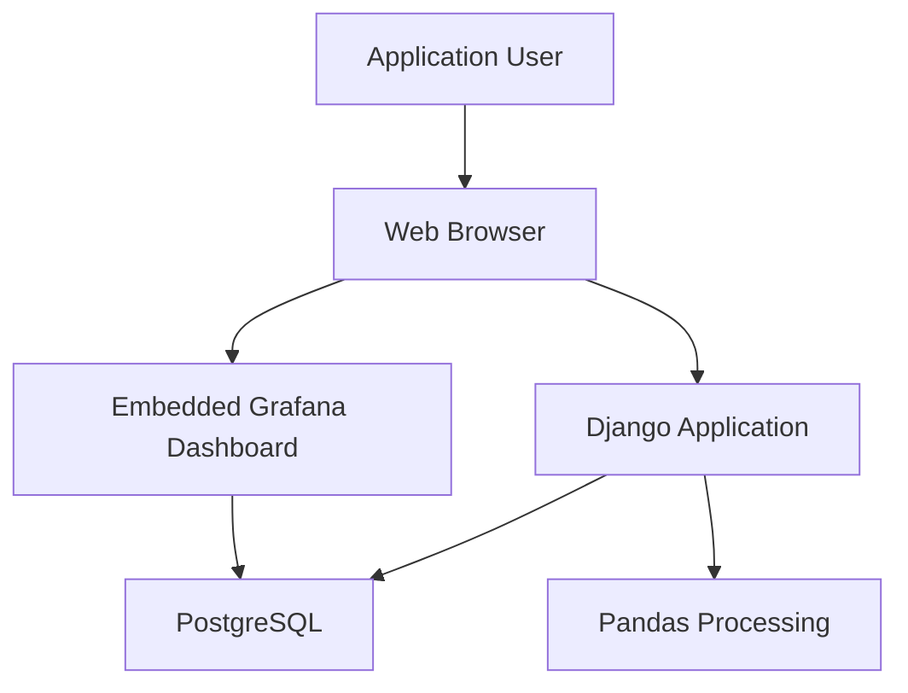
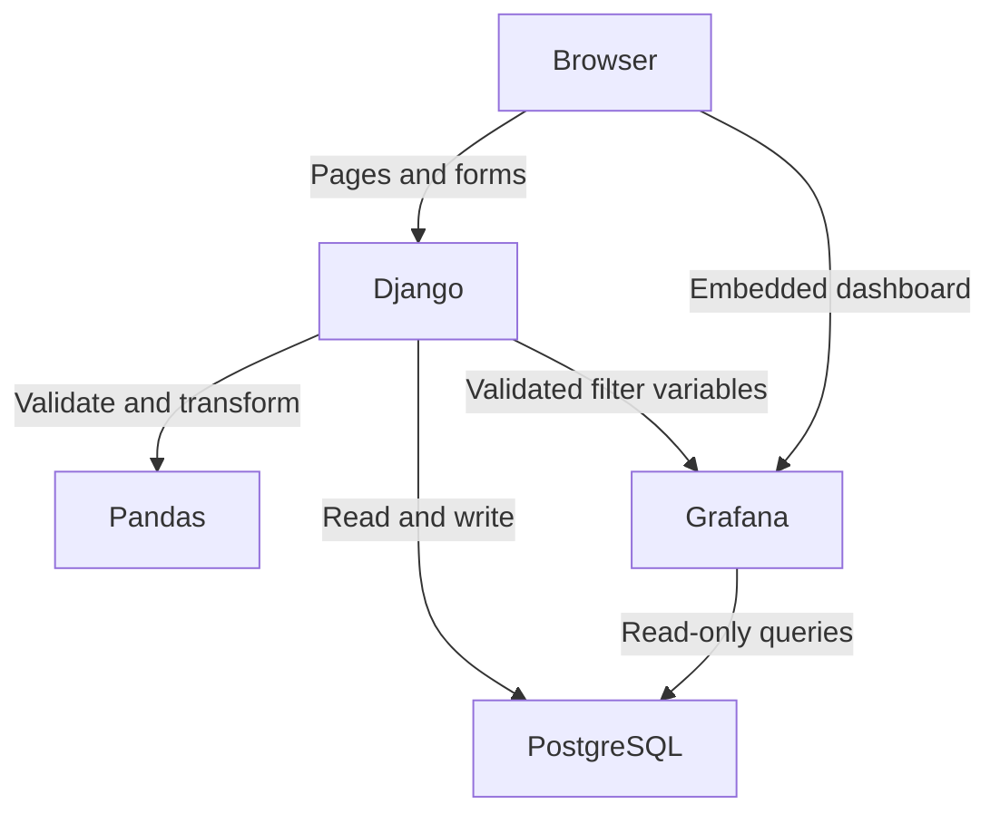
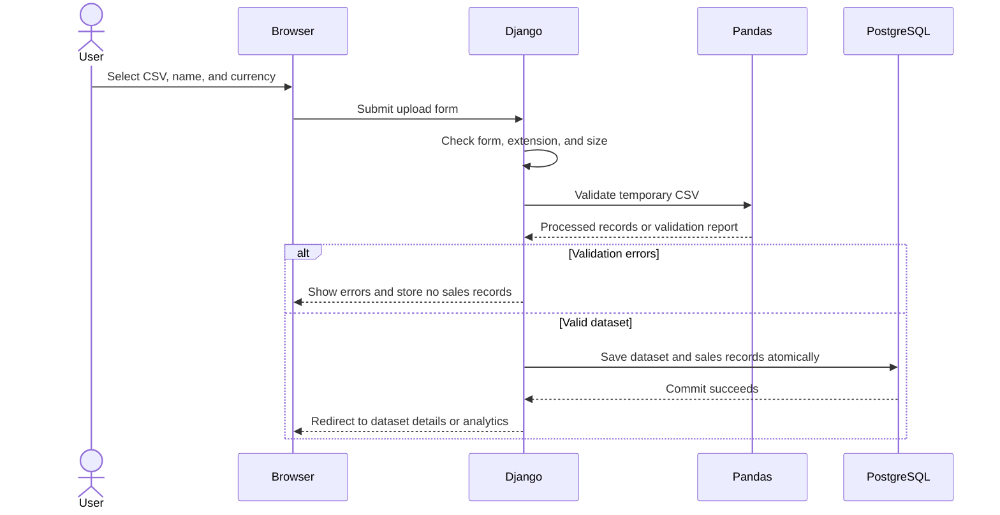
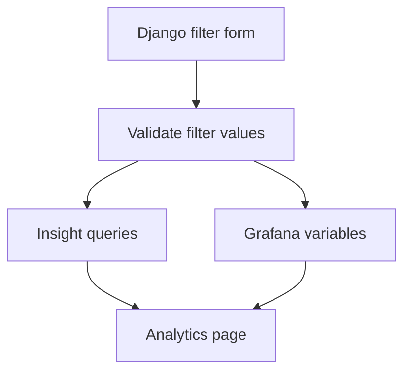
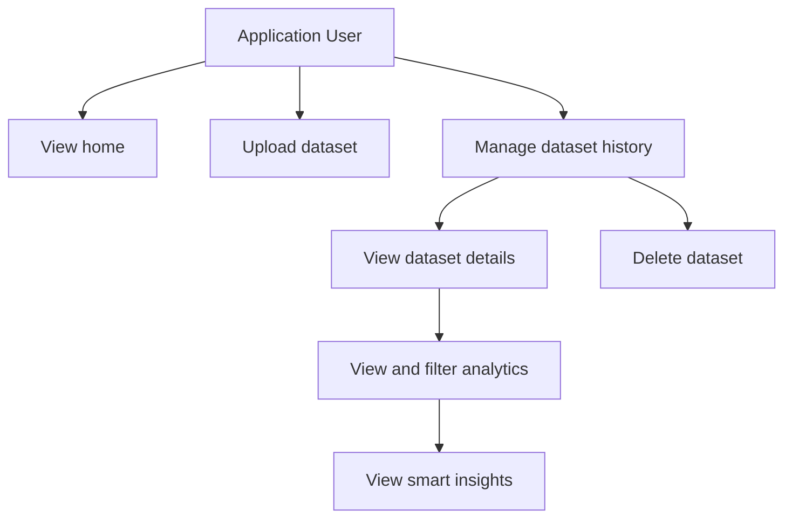

# Vendilume System Design

## 1. Purpose

This document defines the high-level software design of Vendilume. It describes the system boundary, component responsibilities, user interactions, data flow, failure behavior, Grafana integration, and local service architecture.

Detailed CSV fields and validation rules belong in [`DATA_SPECIFICATION.md`](DATA_SPECIFICATION.md). Detailed PostgreSQL entities, fields, constraints, and relationships belong in [`DATABASE_DESIGN.md`](DATABASE_DESIGN.md).

---

## 2. Design Goals

The design follows these principles:

- Keep the MVP small enough to complete and verify.
- Give every component one clear responsibility.
- Treat PostgreSQL as the persistent source of truth.
- Validate a complete dataset before storing any of its sales records.
- Keep analytics consistent with the selected dataset and filters.
- Prefer server-rendered Django pages over a separate frontend application.
- Avoid infrastructure that the MVP does not require.

The core workflow is:

```text
Upload Sales Data
        ↓
Validate and Process Data
        ↓
Store Structured Data
        ↓
View Analytics and Insights
```

---

## 3. System Context

Vendilume is a locally operated web application. The user interacts with it through a browser, while Django, PostgreSQL, and Grafana run as local services.

The MVP has one primary actor:

> **Application User** — a person who uploads sales data, manages imported datasets, and views sales analytics.

User accounts, roles, and authentication are outside the MVP.



The browser never connects directly to PostgreSQL. Django and Grafana access the database through separate database roles with different permissions.

---

## 4. Architectural Style

Vendilume uses a server-rendered Django architecture.

Django Templates and Bootstrap provide the application interface. Django handles requests, business workflows, persistence, and navigation. A separate React frontend and a public REST API are not required for the MVP.

Within Django, the design is divided into logical layers:

| Layer | Responsibility |
| --- | --- |
| Presentation | Django views, forms, templates, messages, and navigation |
| Application services | Upload workflow, dataset management, deletion, analytics context, and insights |
| Data processing | Pandas-based parsing, validation, cleaning, transformation, and calculations |
| Persistence | Django models, ORM operations, transactions, and PostgreSQL |
| Analytics integration | Grafana dashboard URLs, dashboard variables, embedding, and availability handling |

These are logical responsibilities. They do not require separate deployable services.

---

## 5. Component Responsibilities

### 5.1 Web Browser

The browser is responsible for:

- Displaying Django-generated pages.
- Submitting upload and filter forms.
- Displaying validation feedback.
- Rendering the embedded Grafana dashboard.
- Displaying smart insights generated by Django.

The browser must not communicate directly with PostgreSQL or submit database queries.

### 5.2 Django Application

Django is the primary application layer. It is responsible for:

- Home page and navigation.
- CSV upload forms.
- Preliminary file checks.
- Starting the Pandas validation and processing workflow.
- Presenting validation errors and warnings.
- Managing database transactions.
- Storing dataset metadata and processed sales records.
- Dataset history and details pages.
- Dataset selection and deletion.
- Analytics-page access.
- Filter validation and coordination.
- Generating smart insights.
- Constructing safe Grafana embed URLs.
- Handling application errors and user-facing messages.

Django does not generate the main dashboard charts and does not ask Grafana to validate or store uploaded data.

### 5.3 Pandas Processing

Pandas operates as an internal processing component called by Django. It is responsible for:

- Reading the temporary CSV file.
- Normalizing supported column names.
- Validating the complete dataset.
- Cleaning safe formatting differences such as surrounding whitespace.
- Converting dates and numeric values to consistent types.
- Checking cross-row consistency.
- Calculating revenue, discount, cost, and profit values.
- Producing structured records ready for persistence.
- Returning validation errors and warnings to Django.

Pandas does not:

- Handle HTTP requests.
- Render pages.
- Manage user navigation.
- Write directly to Grafana.
- Own permanent storage.

The processing code should return a clear result object to Django containing either processed records or a validation report.

### 5.4 PostgreSQL

PostgreSQL is Vendilume's persistent source of truth. It stores:

- Dataset metadata.
- Processed orders and sales lines.
- Values needed for filtering and analytics.
- Calculated financial values where defined by the database design.
- Validation-warning summaries when they must remain visible after import.

PostgreSQL must enforce important relational constraints in addition to application-level validation.

The original uploaded CSV is not permanent storage. Once a valid dataset has been processed and committed successfully, the structured database records become authoritative.

### 5.5 Grafana

Grafana is the analytics presentation layer. It is responsible for:

- KPI panels.
- Sales trend charts.
- Product and category comparisons.
- Conditional region, channel, customer, discount, cost, and profit panels.
- Applying dashboard variables supplied by Django.
- Querying PostgreSQL for the selected dataset.

Grafana does not:

- Receive or validate CSV uploads.
- Insert, update, or delete Vendilume data.
- Manage dataset history.
- Generate Vendilume's textual smart insights.
- Replace Django pages or navigation.

### 5.6 Docker Compose

Docker Compose manages the local multi-service environment. The planned services are:

| Service | Responsibility |
| --- | --- |
| `web` | Django application and Pandas processing |
| `db` | PostgreSQL database |
| `grafana` | Grafana analytics service |

PostgreSQL and Grafana use named volumes so their persistent state survives ordinary container restarts.

Sensitive configuration belongs in an ignored `.env` file. A committed `.env.example` will document required environment-variable names without containing real secrets.

The MVP does not require Redis, Celery, Nginx, Kubernetes, or a separate API service.

---

## 6. High-Level Component Architecture



The diagram contains two browser-facing paths:

1. Django serves the application pages and manages application behavior.
2. Grafana serves the embedded analytics content inside the Django analytics page.

---

## 7. Uploaded-File Lifecycle

Uploaded CSV files exist only temporarily during validation and processing.

1. Django receives the uploaded file.
2. Django performs preliminary checks such as extension and size.
3. The file is placed in a temporary upload location using an application-generated safe name.
4. Pandas reads and validates the temporary file.
5. If validation fails, Django prepares the error report and deletes the temporary file.
6. If validation succeeds, Django stores the processed data in PostgreSQL within one transaction.
7. After a successful commit, Django deletes the temporary file.
8. If an unexpected processing or database failure occurs, Django rolls back the transaction and deletes the temporary file.

The original filename is retained as dataset metadata, but the original CSV file is not permanently stored in the MVP.

Temporary uploads must not be committed to Git or placed in a public static-files directory.

---

## 8. Upload, Validation, and Import Sequence



### 8.1 Synchronous MVP Processing

The MVP processes uploads synchronously. The user waits for validation and import to complete before receiving the result.

This avoids introducing background-job infrastructure before it is necessary. The supported limit of 10 MB and 100,000 data rows bounds the workload.

Background processing may be considered later if real usage shows that synchronous processing is too slow.

### 8.2 Atomic Persistence

Dataset metadata and all related processed records must be stored in one PostgreSQL transaction.

If any database operation fails:

- The transaction is rolled back.
- No partial dataset remains available for analytics.
- The user receives a general import-failure message.
- Technical details are logged for development and diagnosis.

Bulk database insertion should be used when appropriate to avoid inserting large datasets one row at a time.

---

## 9. Analytics Access and Grafana Integration

### 9.1 Dashboard Access

The user opens analytics from dataset history or the dataset-details page. Django verifies that the selected dataset exists and then renders the analytics page.

The page contains:

- The selected dataset's identity and basic metadata.
- Django-managed filter controls.
- Django-generated smart insights.
- An embedded Grafana dashboard.

### 9.2 Read-Only Database Access

Grafana connects to PostgreSQL with a dedicated database role, conceptually named `grafana_reader`.

This role receives only the permissions needed to read approved analytics tables or views. It must not be permitted to insert, update, delete, or alter Vendilume data.

Django uses a separate application database role with the permissions required to run migrations and manage application data.

### 9.3 Dataset Isolation

Every Grafana query must be restricted by the selected dataset identifier. A dashboard must never accidentally combine unrelated datasets.

Django validates the selected dataset and constructs the embed URL using controlled dashboard variables. User input must not be inserted into the URL or database queries without validation.

### 9.4 Embedding

Grafana is embedded in a Django template using an iframe. Django owns the surrounding page, navigation, dataset context, filters, and insights.

For the local MVP, Grafana may use anonymous Viewer access and allow embedding so the user is not required to complete a second login. Anonymous access must remain limited to viewing the intended dashboards.

This configuration is acceptable for local development but would require a stronger authentication and authorization design before public deployment.

### 9.5 Analytics Availability

If Grafana is temporarily unavailable:

- Django pages and dataset management should remain usable.
- The analytics page should show a clear dashboard-unavailable message.
- Vendilume must not treat Grafana unavailability as loss of stored sales data.

---

## 10. Filter Coordination

Django owns the user-facing analytics filter controls. This gives one validated filter state to both Grafana and the smart-insight service.

Core filters are:

- Date range
- Product
- Category

Conditional filters appear when their source fields exist:

- Region
- Sales channel
- Customer

The filter workflow is:

1. Django displays the available filter values for the selected dataset.
2. The user chooses filters and submits the form.
3. Django validates every filter against the selected dataset.
4. Django passes the approved values to Grafana as dashboard variables.
5. Django passes the same values to the smart-insight service.
6. The page reloads with synchronized charts, KPIs, and insights.



The MVP does not require real-time cross-frame communication between Django and controls changed inside the Grafana iframe. Django's filter form is the authoritative filter interface.

---

## 11. Smart Insights

Smart insights are generated by Django, not Grafana.

The insight service queries PostgreSQL using the selected dataset and the same validated filters applied to Grafana. It evaluates deterministic rules and returns short textual observations.

Examples include:

- Highest-revenue product.
- Strongest-performing category.
- Best sales period.
- Noticeable increase or decrease in revenue.
- Region or channel contributing a large share of sales.
- Product with high revenue but low profit when cost data is available.

This approach keeps smart insights:

- Testable.
- Explainable.
- Consistent with stored data.
- Independent of Grafana's rendered output.

The MVP does not require machine-learning forecasting, a chatbot, or an external generative-AI service.

---

## 12. Dataset Deletion

Dataset deletion is managed only by Django.

1. The user selects delete from dataset history or dataset details.
2. Django displays a confirmation page describing what will be removed.
3. The user confirms through a POST request.
4. Django deletes the dataset and all related records in one transaction.
5. Related records are removed through defined relational cascade behavior.
6. Django redirects the user to dataset history with a success message.

If the user cancels, nothing is deleted.

Grafana performs no deletion action. Once PostgreSQL records are deleted, they no longer appear in Grafana queries.

---

## 13. Major User Interactions

| ID | Use case | User goal |
| --- | --- | --- |
| UC-01 | View home page | Understand Vendilume and access its main functions |
| UC-02 | Upload sales dataset | Submit a CSV file for analysis |
| UC-03 | Receive validation results | Understand whether the file was accepted or rejected |
| UC-04 | View dataset history | See previously imported datasets |
| UC-05 | View dataset details | Inspect information and capabilities of a selected dataset |
| UC-06 | View analytics dashboard | Understand sales performance |
| UC-07 | Filter analytics | Examine a selected part of the dataset |
| UC-08 | View smart insights | Receive automatically generated observations |
| UC-09 | Delete dataset | Remove an unwanted dataset and its sales records |



---

## 14. Use-Case Details

### UC-01 — View Home Page

**Goal:** Access Vendilume's main functions.

**Main flow:**

1. The user opens Vendilume.
2. Django displays a short project introduction.
3. Django provides actions to upload a dataset or view dataset history.
4. The user chooses an action.

The home page remains a navigation point rather than duplicating the analytics dashboard.

### UC-02 — Upload Sales Dataset

**Goal:** Submit a sales CSV file for analysis.

**Main flow:**

1. The user opens the upload page.
2. The user selects a CSV file.
3. The user provides a dataset name and currency.
4. If the name is empty, Django derives it from the original filename.
5. The user submits the form.
6. Django begins the validation workflow.

**Alternative flows:**

- No file is selected: Django displays a required-field error.
- The file extension is unsupported: Django rejects the upload.
- The file exceeds the size limit: Django rejects the upload.

### UC-03 — Receive Validation Results

**Goal:** Understand whether the dataset can be imported.

**Successful flow:**

1. The complete file passes validation.
2. Pandas produces clean, structured records and calculated values.
3. Django stores the dataset atomically.
4. Django displays any non-blocking warnings.
5. The user is redirected to dataset details or analytics.

**Failed flow:**

1. Pandas detects one or more blocking errors.
2. Django stores no permanent sales records from the upload.
3. Django displays the total error count and row-level details.
4. The user corrects the source file and uploads it again.

Vendilume does not provide an in-browser spreadsheet editor in the MVP.

### UC-04 — View Dataset History

**Goal:** Find and manage previously imported datasets.

For each dataset, the page displays:

- Dataset name.
- Original filename.
- Currency.
- Upload date and time.
- Imported row count.
- Order count.
- Earliest and latest order dates.
- Processing status.

Available actions are view details, open analytics, and delete.

Search, renaming, advanced organization, and pagination are deferred until dataset volume makes them necessary.

### UC-05 — View Dataset Details

**Goal:** Understand what a stored dataset contains.

The page displays:

- Dataset name and original filename.
- Currency and upload time.
- Row and order counts.
- Sales date range.
- Available optional fields.
- Retained validation warnings.
- Available and unavailable analytics.

For example, the page explains that profit analytics are unavailable when the dataset does not contain `unit_cost`.

### UC-06 — View Analytics Dashboard

**Goal:** Understand the selected dataset's sales performance.

The core dashboard contains:

- Gross revenue.
- Net revenue.
- Units sold.
- Number of orders.
- Average order value.
- Best-selling product.
- Best-performing category.
- Sales over time.
- Product performance.
- Category performance.

Conditional panels appear only when their required optional data is available.

### UC-07 — Filter Analytics

**Goal:** Focus analytics on a selected part of the dataset.

1. The user chooses one or more available filters.
2. Django validates the values.
3. Django reloads the analytics page.
4. Grafana panels and Django smart insights use the same filter state.
5. The user can clear all filters to return to the complete dataset.

### UC-08 — View Smart Insights

**Goal:** Receive concise observations about the selected data.

1. The user opens or filters analytics.
2. Django queries the matching PostgreSQL records.
3. The insight rules identify notable results.
4. Django displays concise, data-supported statements near the dashboard.

Insights describe existing results and do not claim to predict future performance.

### UC-09 — Delete Dataset

**Goal:** Remove an unwanted dataset.

1. The user selects delete.
2. Django displays a confirmation page.
3. The user confirms deletion.
4. Django deletes the dataset and related records atomically.
5. Django returns the user to dataset history with a success message.

If the user cancels, no data is changed.

---

## 15. Conditional Analytics

Some analytics depend on optional CSV fields.

| Available field | Additional capabilities |
| --- | --- |
| `unit_cost` | Total cost, profit, and profit-margin analysis |
| `region` | Regional panels and region filter |
| `sales_channel` | Channel panels and channel filter |
| `customer_id` | Unique-customer statistics and customer filter |
| `discount_percent` | Discount amount and discount analysis |

Django determines which optional data is available and prevents unsupported panels or controls from being presented as if they contained complete information.

Aggregate cost, profit, and profit-margin panels are enabled only when `unit_cost` is available for every relevant sales row. If cost data is incomplete, Vendilume reports that limitation instead of presenting a partial total as the dataset's complete profit.

Missing text dimensions such as `region` or `sales_channel` may be grouped under an `Unknown` label so their rows remain included in overall totals while the known values can still be compared.

---

## 16. Failure Handling

| Failure | Required behavior |
| --- | --- |
| Invalid upload form | Display field-specific feedback; do not start processing |
| CSV validation errors | Reject the complete import and display the validation report |
| Unexpected processing error | Store no partial dataset, delete the temporary file, log details, and show a general error |
| PostgreSQL write failure | Roll back the complete transaction and show an import-failure message |
| Missing dataset identifier | Return a normal not-found page rather than exposing an internal error |
| Invalid filter value | Reject or safely ignore the value and explain the problem |
| Grafana unavailable | Keep Django usable and show an analytics-unavailable message |
| Insight calculation failure | Keep the dashboard usable and show that insights are temporarily unavailable |
| Dataset deletion failure | Roll back the deletion and report that no confirmed deletion occurred |

User-facing messages should explain what the user can do next. Technical stack traces and secrets must never be displayed in normal application pages.

---

## 17. Security and Data-Safety Boundaries

The local MVP still follows basic safety rules:

- Accept only the supported upload type and enforce file limits.
- Generate safe temporary filenames instead of trusting uploaded paths.
- Keep temporary files outside public static directories.
- Validate all dataset identifiers and filter values.
- Use Django's CSRF protection for state-changing forms.
- Perform deletion only through POST after confirmation.
- Keep credentials and secrets in environment variables.
- Give Grafana a read-only PostgreSQL role.
- Avoid rendering raw exception details to users.
- Use parameterized ORM or SQL queries.

Public deployment, multi-user data isolation, full authentication, authorization, rate limiting, and production proxy configuration are outside the MVP and must be designed before exposing the application publicly.

---

## 18. Explicit MVP Exclusions

The system design does not include:

- React or another separate frontend framework.
- Django REST Framework or a public API.
- User accounts and role management.
- Background task queues.
- Real-time sales integrations.
- Permanent storage of original uploaded CSV files.
- In-browser spreadsheet editing.
- Advanced machine learning or forecasting.
- A chatbot or external generative-AI dependency.
- Grafana write access to application data.
- Public-cloud deployment architecture.

These features may be reconsidered only after the core workflow is implemented and verified.

---

## 19. Design Decisions Summary

| Decision | Selected approach |
| --- | --- |
| Application style | Server-rendered Django web application |
| Primary interface | Django Templates with Bootstrap |
| CSV processing | Internal synchronous Pandas service |
| Permanent storage | PostgreSQL structured records |
| Original CSV retention | Temporary only; delete after processing |
| Import consistency | One atomic database transaction |
| Analytics | Embedded Grafana dashboard |
| Grafana database access | Dedicated read-only PostgreSQL role |
| Analytics filters | Django-owned controls passed to Grafana variables |
| Smart insights | Deterministic Django service querying PostgreSQL |
| Dataset deletion | Confirmed Django POST with relational cascade |
| Local services | Docker Compose: Django, PostgreSQL, and Grafana |
| Background jobs | Not included in the MVP |

---

## 20. Completion Criteria

The system design is sufficiently implemented when:

1. The user can navigate between home, upload, dataset history, dataset details, and analytics pages.
2. Django can call the Pandas processing service and receive a structured result.
3. Invalid datasets produce feedback without permanent sales records.
4. Valid datasets are saved completely within one database transaction.
5. Temporary CSV files are removed after success or failure.
6. Grafana reads approved PostgreSQL data without write permissions.
7. The selected dataset restricts every analytics query.
8. Django filters produce consistent Grafana panels and smart insights.
9. Dataset deletion removes related records only after confirmation.
10. Docker Compose can run Django, PostgreSQL, and Grafana together locally.